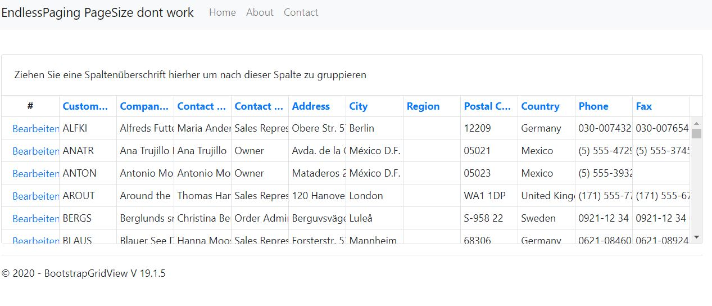

# DXBsEndlessPagingIssue
No matter which PageSize you define in SettingsPager, it doesnt do any difference
, only 6 rows are shown always
```
<SettingsPager Mode="EndlessPaging" PageSize="100" />
```




## Solution
Change Settings-VerticalScrollableHeight property of the grid 

```
Settings-VerticalScrollableHeight="500" 
```

