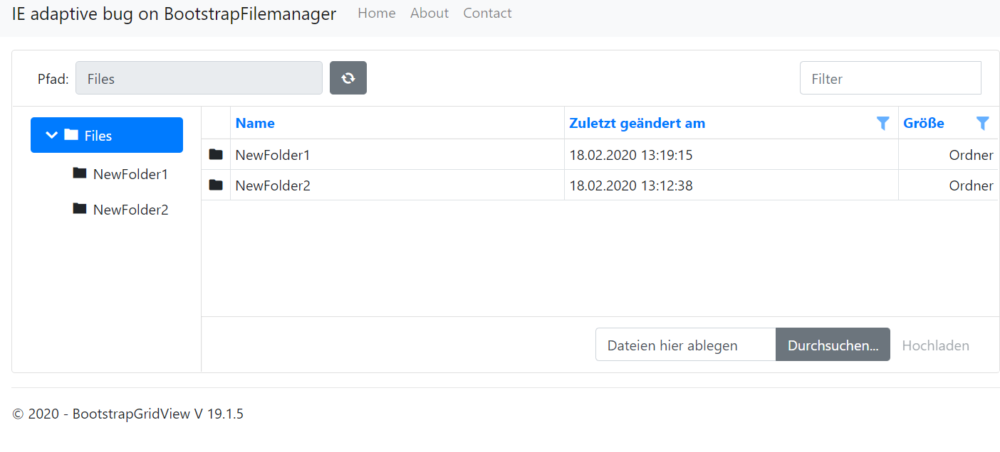
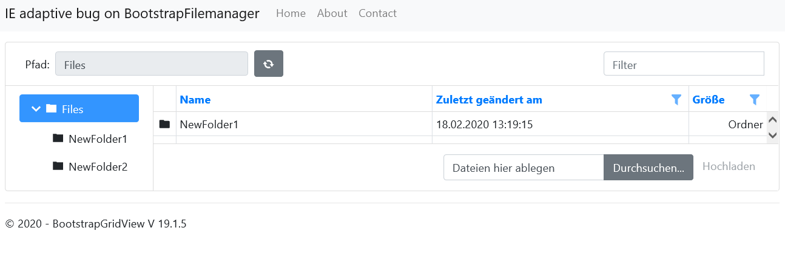

# BootstrapFileManager IE adaptive bug
On Chrome and Firefox its fine , on IE the height is not properly adapted.
If you set a fixed height as a workaround its rerenders the control on every click, what
is even worse than the first problem.

